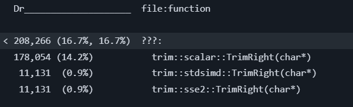
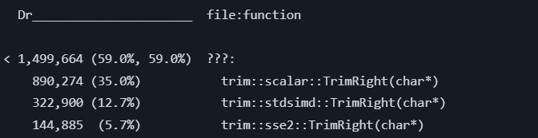
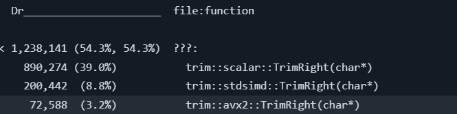
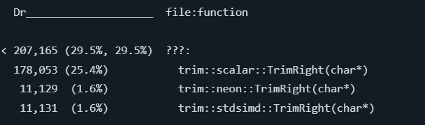
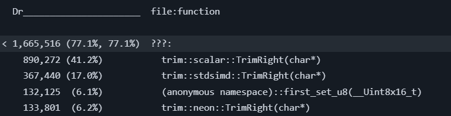

# Тестовое задание для стажера по направлению *Младший программист C++*
## Структура папок
- `src` - папка, содержащая файлы с исходным кодом
- `tests` - папка, содержащая файлы с Unit-тестами

## Описание программы
Основной задачей при реализации заданной функции `void TrimRight(char* s)` являлось сокращение обращений к памяти с расчетом на очень длинные строки. Было принято решение, что наиболее эффективно здесь - использование SIMD инструкций, и реализовано несколько подходов:
1. Первый подход заключается в использовании заголовка стандартной библиотеки C++ `<simd>` (`<experimental/simd>`) из C++26;
2. Второй подход - использование интринсиков с разными инструкциями для Intel, AMD / ARM.
Также добавлена функция с обычной линейной реализацией - скалярный вариант для сравнения.

В `main.cpp` - демонстрационная программа, запускающая все реализации, строка передается в виде файла первым аргументом программы при запуске.

## Сборка проекта
Проект собирается с помощью Makefile.

**Поддерживаемые цели сборки make:**
- Сборка программы
```
make build
```
- Сборка тестов
```
make tests
```
- Запуск программы
```
make run
```
Для передачи дополнительных параметров используется переменная ARGS (при помощи GNU Make):
```
make run ARGS="resources/long-str.txt"
```
- Запуск тестов
```
make test
```

## Результаты
Эффективность решений, проверялась с помощью инструмента `cachegrind` от `valgrind`, который эмулирует кэш-память процессора и подсчитывает, сколько раз программа обращается к разным уровням кэша и насколько успешно. Основной анализируемый параметр - `Dr (Data read)`: количество операций чтения из памяти.

С помощью GitHub Actions запускаются все реализации функции `TrimRight`, на своих платформах, выполняется `cachegrind` и результаты выводятся с помощью инструмента `cg_annotate`, также встроенного в `valgrind`.

### Поряд шагов в Actions
1. На первом этапе для всех реализаций прогоняются Unit-тесты;
2. При успешном завершении первого этапа:
  - Для каждого SIMD-расширения собирается демонстрационная программа с двумя вариантами оптимизации компилятора: `-O3` и `-O0`;
    - SSE2: раннер `ubuntu-latest`, специальные опции компилятора `-msse2`,
    - AVX2: раннер `ubuntu-latest`, специальные опции компилятора `-mavx2`,
    - NEON: раннер `ubuntu-24.04-arm`, специальные опции компилятора `-march=armv8-a+simd`,
 - Для результатов сборки выполняется команда `valgrind --tool=cachegrind --cache-sim=yes`;
3. Файлы `cachegrind.out` анализируются с помощью команды `cg_annotate --show=Dr --auto=no --threshold=1.0`, выводя в процентах количество операций чтения из памяти для используемых функций;

Проводится сравнение трех функций: скалярной, функции на std::simd и функции на платформозависимых интринсиках. Но так как для последних есть 3 реализации, сравнение проводится 3 раза.

### Просмотр результатов
Чтобы посмотреть результаты команды `cg_annotate` нужно в шаге `result` открыть соответствующий пункт:
- Output Results SSE2;
- Output Results AVX2;
- Output Results NEON.

### Анализ результатов

Для каждого из трех сравнений результаты похожи. Функции, использующие SIMD-инструкции проводят операций чтения из памяти в несколько раз меньше. Значения изменяются в зависимости от опции оптимизации компилятора.

Рассмотрим результаты на примере предпоследнего выполнения GitHub Actions (https://github.com/Ksenia-rgb/dr-traineeship-cxx-junior/actions/runs/37538464093/job/112525702738):

*Сравнение скалярной реализации, реализации на std::simd и реализации на SSE2:*

При `-O3`:

По сравнению со скалярной реализацией

- Реализации на std::simd - в ~15,7 раз меньше операций чтения из памяти;
- Реализации на sse2 - в ~15,7 раз меньше операций чтения из памяти.



При `-O0`:

По сравнению со скалярной реализацией

- Реализации на std::simd - в ~7,5 раз меньше операций чтения из памяти;
- Реализации на sse2 - в ~6 раз меньше операций чтения из памяти.



*Сравнение скалярной реализации, реализации на std::simd и реализации на AVX2:*

При `-O3`:

По сравнению со скалярной реализацией

- Реализации на std::simd - не отображается, больше чем в 15 раз меньше операций чтения из памяти;
- Реализации на avx2 - не отображается, больше чем в 15 раз меньше операций чтения из памяти.


При `-O0`:

По сравнению со скалярной реализацией

- Реализации на std::simd - в ~12 раз меньше операций чтения из памяти;
- Реализации на avx2 - в ~4,4 раз меньше операций чтения из памяти.



*Сравнение скалярной реализации, реализации на std::simd и реализации на NEON:*

При `-O3`:

По сравнению со скалярной реализацией

- Реализации на std::simd - в ~15,8 раз меньше операций чтения из памяти;
- Реализации на neon - в ~15,8 раз меньше операций чтения из памяти.



При `-O0`:

По сравнению со скалярной реализацией

- Реализации на std::simd - в ~2,4 раз меньше операций чтения из памяти;
- Реализации на neon - в ~6,6 раз меньше операций чтения из памяти.



По приведенным результатам реализация на интринсиках - явном указании SIMD-расширения - в большинстве более эффективна по количеству операций чтения из памяти.
